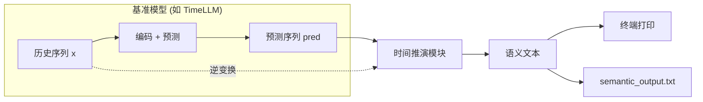
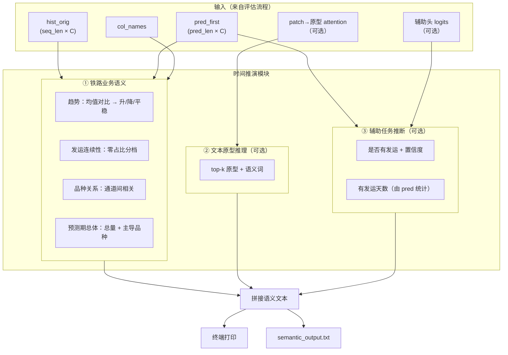

# 时间推演模块 · 架构图（可粘贴到基准模型框架后）

下方为 Mermaid 图，可在支持 Mermaid 的编辑器（如 Typora、VS Code 插件、GitHub、Notion）中直接渲染；也可复制到 [Mermaid Live](https://mermaid.live) 导出 PNG/SVG 插入 PPT/Word。

---

## 整体流程：基准模型 → 时间推演模块



---

## 时间推演模块内部结构（详图）



---

## 简化单图（仅框 + 箭头，适合贴进论文/汇报）


---

## 粘贴说明

- **论文 / 汇报**：用 Mermaid Live 打开「整体流程」或「简化单图」，导出 SVG 或 PNG 插入。
- **技术文档**：直接保留本 Markdown，在支持 Mermaid 的查看器中即可看到图。
- **与基准框架的关系**：时间推演模块接在**基准模型推理之后**，输入为模型输出的 `pred` 与数据侧的 `hist`（逆变换后），输出为可读的语义文本，**不参与训练、不改变模型结构**。

---

## 可直接粘贴的 SVG 图

同目录下已提供 **`时间推演模块-架构图.svg`**，可直接插入 Word、PPT 或网页：

- **Word / PPT**：插入 → 图片 → 选择该 SVG（或先转为 PNG 再插入）。
- **网页 / 技术文档**：``。

---

## 纯文本示意图（无渲染器时可用）

```
  ┌─────────────────┐
  │   基准模型       │  历史 x → 预测 pred
  │ (TimeLLM 等)    │
  └────────┬────────┘
           │ pred, hist
           ▼
  ┌────────────────────────────────────────────────────────┐
  │                    时间推演模块                          │
  │  ┌──────────────────┐  ┌──────────────────┐              │
  │  │ ① 铁路业务语义    │  │ ② 文本原型推理   │              │
  │  │ 趋势/连续性/总体  │  │ top-k 原型（可选）│              │
  │  └──────────────────┘  └──────────────────┘              │
  │  ┌──────────────────────────────────────┐                │
  │  │ ③ 辅助任务推断（可选）是否有发运+天数  │                │
  │  └──────────────────────────────────────┘                │
  │                         ↓ 拼接                           │
  │              语义文本（规则+模板，无大模型）               │
  └────────────────────────┬───────────────────────────────┘
                           ▼
              终端打印 + semantic_output.txt
```
